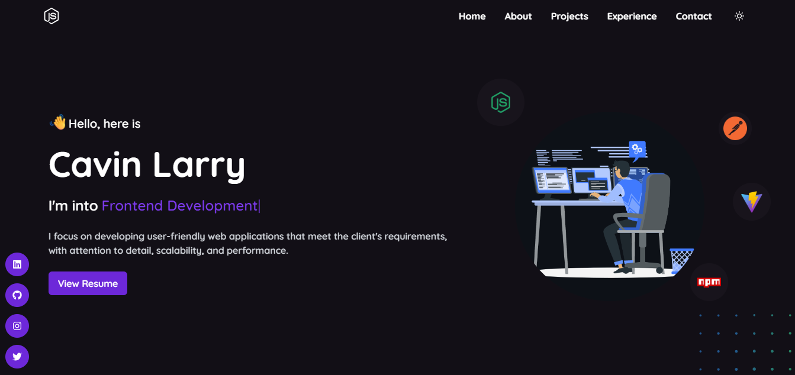

<p align="center">
  <a href="#introduction-">Introduction</a> •
  <a href="#tech-stack-%EF%B8%8F">Tech Stack</a> •
  <a href="#development-">Development</a> •
    <a href="#deployment-">Deployment</a> •
  <a href="#license-">License</a>
</p>

</div>

## Introduction 👋
This is a personal portfolio web application built with NextJS, TypeScript, TailwindCSS and Firebase.

## Tech Stack 🛠️

 <p>
 <a href="https://nextjs.org">
    
    </a>
  <a href="https://tailwindcss.com">
    
  </a>
  <a href="https://www.typescriptlang.org">
    
  </a>
</p>

## Development 💻

Here are the steps to run the portfolio locally.

1. Fork or clone [this](https://github.com/Killercavin/Cavin.git) repository.

2. Clone your forked copy of the repo

   ```bash
   git clone https://github.com/Killercavin/Cavin.git
   ```

3. Install dependencies

   ```bash
   npm i
   ```

4. Create a Firebase project and select the web app

5. Create an `.env.local` file in the root directory, and add the following variables with your firebase config:
   ```
   NEXT_PUBLIC_FIREBASE_API_KEY
   NEXT_PUBLIC_FIREBASE_AUTH_DOMAIN
   NEXT_PUBLIC_FIREBASE_DATABASE_URL
   NEXT_PUBLIC_FIREBASE_PROJECTID
   NEXT_PUBLIC_FIREBASE_STORAGE_BUCKET
   NEXT_PUBLIC_FIREBASE_MESSAGING_SENDERID
   NEXT_PUBLIC_FIREBASE_APPID
   NEXT_PUBLIC_FIREBASE_MEASUREMENTD
   SENDGRID_API_KEY
   MAIL_FROM
   MAIL_TO
   ```
   <!-- write text to tell user to get sendgrid keys from dashboard and add here -->

> **Note**: `SENDGRID_API_KEY` - Create an API key from "Settings" -> "API Keys" with "Restricted Access" to only "Mail Send"

1. Update the sample [data.json](https://github.com/Killercavin/Cavin/blob/main/data.json) provided, with your data or directly import the same and edit using firebase later. (For storing images you can use [Cloudinary](https://cloudinary.com) or [Firebase Storage](https://firebase.google.com/docs/storage))

2. Import json data

   - Go to [Firebase Console](https://console.firebase.google.com) and select your project
   - Go to "Database" -> "Realtime Database" -> "Import JSON" and import the [data.json](https://github.com/Killercavin/Cavin/blob/main/data.json) file

3. Run the project

   ```bash
   npm run dev
   ```

## Deployment 🚀

1. Create a Vercel or Netlify account and select "Import Project"

2. Select the forked repository and deploy

3. Add the following environment variables in the Vercel dashboard:
   ```
   NEXT_PUBLIC_FIREBASE_API_KEY
   NEXT_PUBLIC_FIREBASE_AUTH_DOMAIN
   NEXT_PUBLIC_FIREBASE_DATABASE_URL
   NEXT_PUBLIC_FIREBASE_PROJECTID
   NEXT_PUBLIC_FIREBASE_STORAGE_BUCKET
   NEXT_PUBLIC_FIREBASE_MESSAGING_SENDERID
   NEXT_PUBLIC_FIREBASE_APPID
   NEXT_PUBLIC_FIREBASE_MEASUREMENTD
   SENDGRID_API_KEY
   MAIL_FROM
   MAIL_TO
   ```
4. Hurray! You successfully deployed the portfolio🥳

## License 📄

This project is licensed under the MIT License - see the [LICENSE.md](https://github.com/Killercavin/Cavin/main/LICENSE.md)

## Contact 📬

If you want to contact me, you can reach me through below handles.

[](https://www.linkedin.com/in/killercavin)

## Support 🙌

If you like this portfolio, please consider giving it a ⭐ on GitHub and sharing it with your friends via social media.
